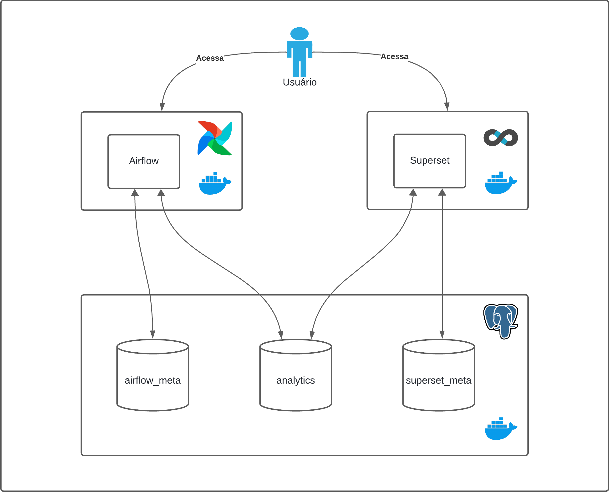
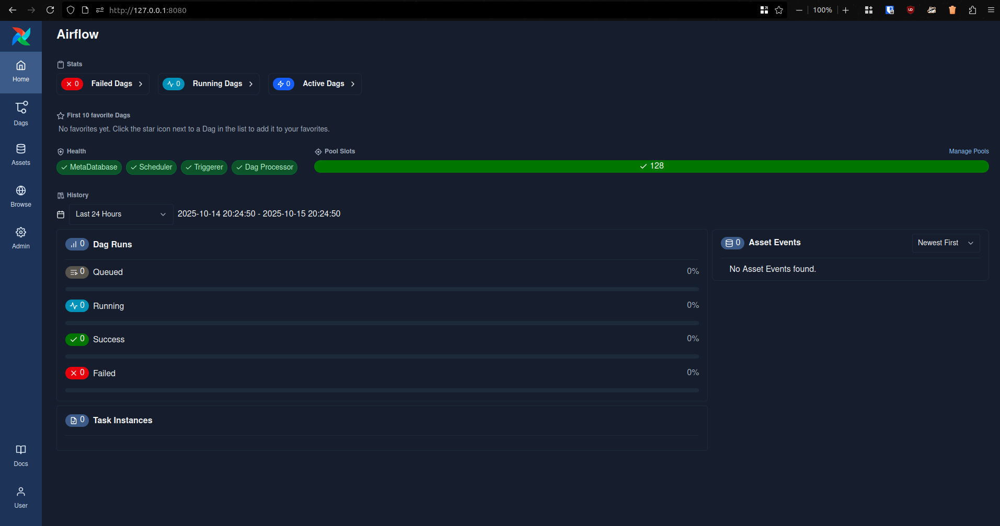
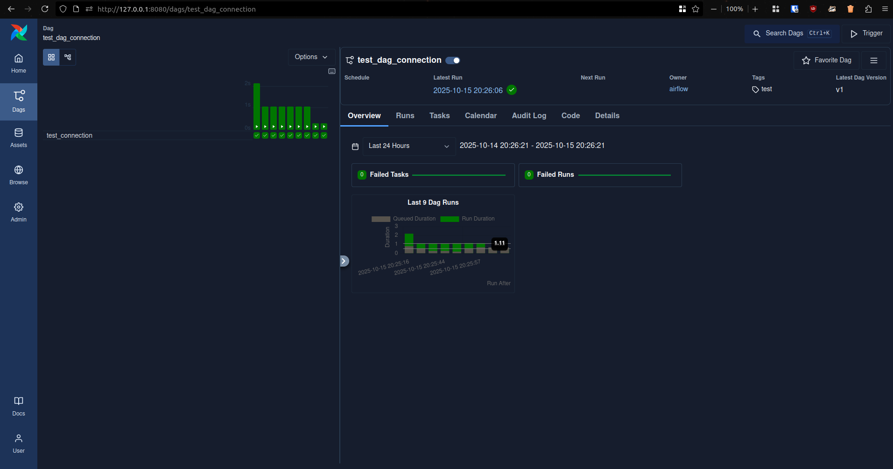
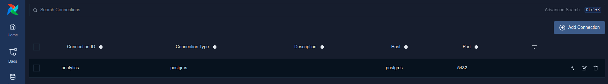
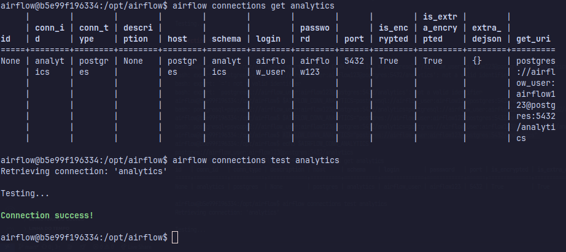
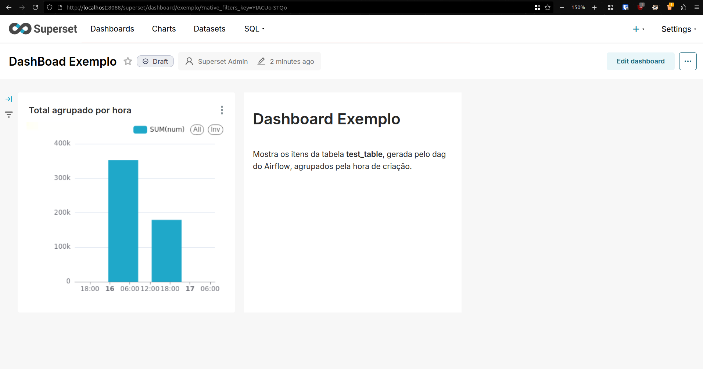
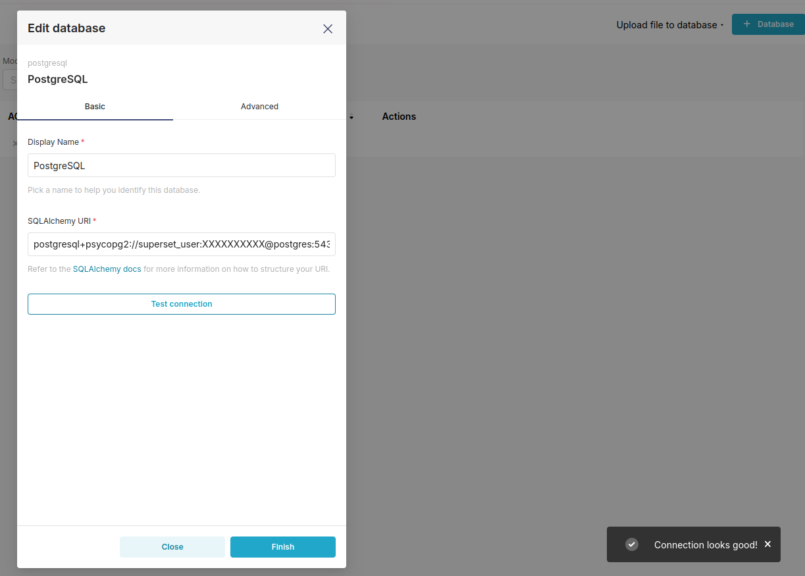

# Desafio Stack Dados 2025

## Sumário

- [Introdução](#introdução)
- [Postgres](#postgres)
- [Airflow](#airflow)
- [Superset](#superset)

## Introdução

Este repositório apresenta a solução para o Desafio Stack Dados 2025, que consiste em criar um ambiente integrado de análise de dados usando Docker. O projeto utiliza PostgreSQL para armazenamento, Apache Airflow para automação de processos e Apache Superset para visualização de dados em dashboards.

<div align="center">
    
    <p>Diagrama de arquitetura simplificado</p>
</div>

Para rodar o projeto, tendo o Docker instalado na máquina e tendo preenchido o arquivo *.env*, rode:
```sh
docker compose up
```
Por padrão os serviços se encontrarão em:

- Airflow: [localhost:8080](http://localhost:8080)
- Superset: [localhost:8088](http://localhost:8088)


## Postgres

A configuração do banco de dados foi feita por meio de uma imagem extendida do postgres na qual passamos um script *.sh* como entrypoint para o contêiner. O scipt contêm instruções para a criação das bases a serem utilizadas, a criação dos usuários para os respectivos serviços e o plano de controle de acesso ao banco. 

<p>O banco de dados foi modelado da seguinte forma:</p>

| Base              | Função                                 | Acesso                       |
| ----------------- | -------------------------------------- | ---------------------------- |
| **airflow_meta**  | Armazenamento de metadados do Airflow  | Airflow                      |
| **superset_meta** | Armazenamento de metadados do Superset | Superset                     |
| **analytics**     | Data Warehouse local                   | Airflow e Superset (leitura) |

<p style="text-align: center">Modelagem banco de dados</p>

Para configurar o banco usei as seguintes variáveis de ambiente:

- `POSTGRES_HOST`, `POSTGRES_PORT`, `POSTGRES_DB`

    Para configurar respectivamente o host, a porta e a base inicial. São preenchidas com "postgres", "5432" e "postgres", respectivamente.

- `POSTGRES_USER`, `POSTGRES_PASSWORD`

    Para configurar o login ao banco. Devem ser preenchidas.

- `AIRFLOW_PSQL_USER`, `AIRFLOW_PSQL_PASS`, `SUPERSET_PSQL_USER`, `SUPERSET_PSQL_PASS`

    Para configurar os logins dos usuários a serem utilizados pelos serviços do Airflow e Superset, respectivamente. Devem ser preenchidas.

Abaixo encontra-se um GIF mostrando uma validação na qual demonstra que as bases de metadados estão sendo usadas corretamente e estão alocadas no contêiner Postgres:

<div align="center">
    
    <p>Visualização bases de metadados</p>
</div>


## Airflow

O Airflow está rodando em um contêiner e inicializado com o comando `standalone`, que inicia todos os componentes do Airflow e configura o banco de dados. É importante notar que esse método só é indicado para ambientes de desenvolvimento. Foi feito um bind de diretórios locais para dags, logs e plugins com os do contêiner. Dentro do diretório *airflow/dags*, deixei um DAG de exemplo que grava um número aleatório e a data atual na base *anlytics* do Postgres. Os DAGs presentes no diretório local são carregados automaticamente na aplicação.

A configuração do Airflow se deu somente por meio de variáveis de ambiente. A seguir estão as variáveis utilizadas, bem como a sua função no sistema:

- `AIRFLOW__CORE__TEST_CONNECTION`

    Define que o teste de conexão esteja habilitado. Está preenchida com "Enabled".

- `AIRFLOW__DATABASE__SQL_ALCHEMY_CONN`

    Define a conexão com a base de dados que será utilizada para guardar os metadados. Está preenchida com a URI adequada, que é expandida automaticamente dentro do contêiner.

- `AIRFLOW_CONN_ANALYTICS`

    Define uma conexão com o banco de dados que será criada automaticamente junto com a aplicação, neste caso com o *conn-id* sendo *analytics*. Por algum motivo, essa conexão não aparece na interface, mas é possível utilizá-la mesmo assim. Está preenchida com a URI adequada, que é expandida automaticamente dentro do contêiner.

    > Link para documentação do Airflow que mostra essa variável de ambiente [aqui](https://airflow.apache.org/docs/apache-airflow/stable/cli-and-env-variables-ref.html#envvar-AIRFLOW_CONN_-CONN_ID).


Abaixo encontram-se prints da interface do Airflow funcionando.

<div align="center">
    
    <p>Interface Airflow</p>
</div>

<div align="center">
    
    <p>Página de execução de DAG de exemplo</p>
</div>

### Teste de conexão

Apesar de a conexão com o banco funcionar adequadamente e ser possível comprovar de outras maneiras, eu não consegui comprovar por meio do teste de conexão via UI do Airflow, como pedia o desafio.

Como foi citado anteriormente, a conexão padrão indicada na variável de ambiente, apesar de funcional, não é reconhecida na página de conexões (Home -> Admin -> Connections). Portanto, para fazer o teste, rodei a aplicação sem informar a variável no *.env* (para garantir) e criei pela interface a conexão seguindo os mesmos parâmetros. Abaixo está a conexão criada:

<div align="center">
    
    <p>Página das conexões</p>
</div>

Ao clicar no botão de Teste de Conexão, nada acontecia na interface, e o Postgres apresentava a mensagem disposta abaixo no log, mesmo as credenciais estando corretas e os DAGs conseguirem utilizá-la, como evidencia o print da página de DAGs.

```sh
postgres  | 2025-10-16 21:48:06.579 UTC [2266] FATAL:  password authentication failed for user "airflow_user"
postgres  | 2025-10-16 21:48:06.579 UTC [2266] DETAIL:  Connection matched file "/var/lib/postgresql/18/docker/pg_hba.conf" line 128: "host all all all scram-sha-256"
```

Entretanto, ao fazer o teste de conexão via CLI, dentro do contêiner do Airflow e com a mesma conexão, o teste era bem-sucedido. Abaixo há um print mostrando a sua realização:

<div align="center">
    
    <p>Teste de conexão CLI</p>
</div>

Não sei o que causa isso, nem se é necessariamente um problema da minha configuração, mas a conexão funciona.

---

### Detalhe importante

<p>Para realizar a autenticação no Airflow, é necessário buscar a senha gerada nos logs aplicação.</p>

Procure por esta estrutura no terminal:
```
airflow  | standalone | Starting Airflow Standalone
airflow  | Simple auth manager | Password for user 'admin': sk5GvsxYfdQvKr5f <-- SENHA!
airflow  | standalone | Checking database is initialized
airflow  | standalone | Database ready
airflow  | triggerer  | ____________       _____________
airflow  | triggerer  | ____    |__( )_________  __/__  /________      __
airflow  | triggerer  | ____  /| |_  /__  ___/_  /_ __  /_  __ \_ | /| / /
airflow  | triggerer  | ___  ___ |  / _  /   _  __/ _  / / /_/ /_ |/ |/ /
airflow  | triggerer  | _/_/  |_/_/  /_/    /_/    /_/  \____/____/|__/
```

Ou então, caso esteja difícil de achar, rode em um terminal separado:
```sh
docker compose logs | grep "Simple auth manager | Password for user 'admin':" | awk -F"': " '{print $2}'
```

## Superset

Para configurar o Superset, extendi a imagem (utilizei a tag *dev* pois ela já vem o com o *psycopg2* por padrão) para poder adicionar um script *.sh* com os comandos de inicialização e um comando para criar a conexão com o Postgres automaticamente, além de um arquivo *python* que instancia as variáveis de ambiente, seguindo a recomendação da documentação do Superset.

As variáveis de ambiente utilizadas foram:

- `SUPERSET_USER`, `SUPERSET_PASS`

    Para configurar o login da interface Web. Devem ser preenchidas.

- `SUPERSET_PORT`

    Para configurar a porta a ser utilizada. Está preenchida com "8088"

- `SUPERSET_SQLALCHEMY_DATABASE_URI`

    Define a conexão com a base de dados que será utilizada para guardar os metadados. Está preenchida com a URI adequada, que é expandida automaticamente dentro do contêiner.

- `SUPERSET_CONN_ANALYTICS`

    URI da conexão com a base *analytics*, é utilizada no script de inicialização para criar automaticamente a conexão. Está preenchida com a URI adequada, que é expandida automaticamente dentro do contêiner.

Abaixo encontra-se um print de um dashboard que eu fiz utilizando os dados gerados pelo DAG de exemplo:

<div align="center">
    
    <p>Interface do Superset funcionando com dashboard</p>
</div>

### Teste de conexão

O teste de conexão do Superset foi realizado sem problemas. Para realizá-lo navegue até a página Databse Connections (Settings -> Database Connections) e clique para editar a conexão que está (deve) lá, em seguida clique em "Test Connection" e veja o resultado.

Abaixo encontra-se um print do teste de conexão via UI do Superset:

<div align="center">
    
    <p>Teste de conexão com o banco no Superset</p>
</div>

## Referências

- Imagem do Postgres no DockerHub, disponível em: [https://hub.docker.com/_/postgres](https://hub.docker.com/_/postgres)
- Documentação oficial do Airflow, disponível em: [https://airflow.apache.org/docs/apache-airflow/stable/index.html](https://airflow.apache.org/docs/apache-airflow/stable/index.html)
- Documentação oficial do Superset, disponível em: [https://superset.apache.org/docs/intro/](https://superset.apache.org/docs/intro/)
- Repositório oficial do Superset, disponível em: [https://github.com/apache/superset](https://github.com/apache/superset)

---

[⬆️ Voltar ao topo](#desafio-stack-dados-2025)
